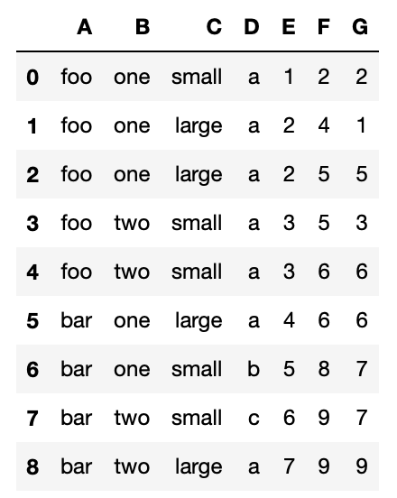
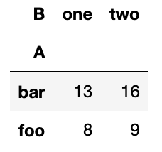

#  What does this element do?
## 1. pl-plvot-table helps instructor to write questions for pandas pivot table operation practice.  
## 2. Students will drag and drop from row, column, and index set provided to complete the dataframe. In other words, students will assemble dataframe like building lego block.  

# Slide deck(Basic plan and idea of this project)
https://docs.google.com/presentation/d/1K6x-VDJGsnKooS1rQ43vHO1SW6SUSoAYT_lzCyHY5l8/edit#slide=id.g2808ed675f2_1_10

# How can I author question?
Here, we will create two questions with fews example: One question for single index dataframe, and the other for double-index dataframe.  
**We will walk through ALL tutorials using below dataframe**
```
df = pd.DataFrame({"A": ["foo", "foo", "foo", "foo", "foo",
                         "bar", "bar", "bar", "bar"],
                   "B": ["one", "one", "one", "two", "two",
                         "one", "one", "two", "two"],
                   "C": ["small", "large", "large", "small",
                         "small", "large", "small", "small",
                         "large"],
                   "D":["a","a","a","a","a","a","b","c","a"],
                   "E": [1, 2, 2, 3, 3, 4, 5, 6, 7],
                   "F": [2, 4, 5, 5, 6, 6, 8, 9, 9],
                   "G": [2, 1, 5, 3, 6, 6, 7, 7, 9]})
```
  

### Example of single index dataframe:

1. Let's author question for this syntax  
```
df.pivot_table(index='A', columns='B', values='G', aggfunc='sum')
```
Dataframe after this operation will look like this:  
  
